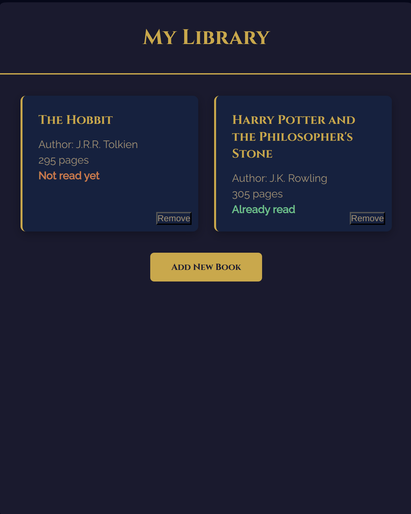

# Library App - The Odin Project
This project is part of the [The Odin Project](https://www.theodinproject.com) curriculum.
It is a digital library app.

## Preview
You can access the app [here](https://louis-dub.github.io/library_app_odin/).

## Features
With this app, you can:
- Add books
- Remove books

## Technologies Used
- **HTML5**: For the semantic structure of the app
- **CSS3**: For custom styling
- **JavaScript**: For retrieving information, adding books, and removing books

## What I Learned
- JavaScript object manipulation
- DOM manipulation in JavaScript
- Retrieving form data in JavaScript